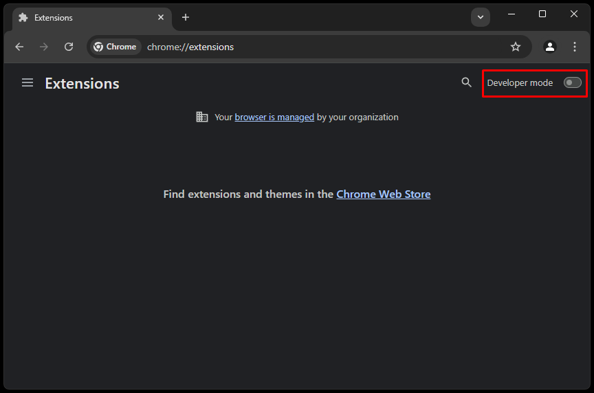
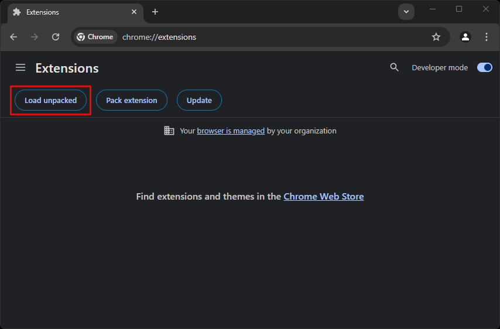
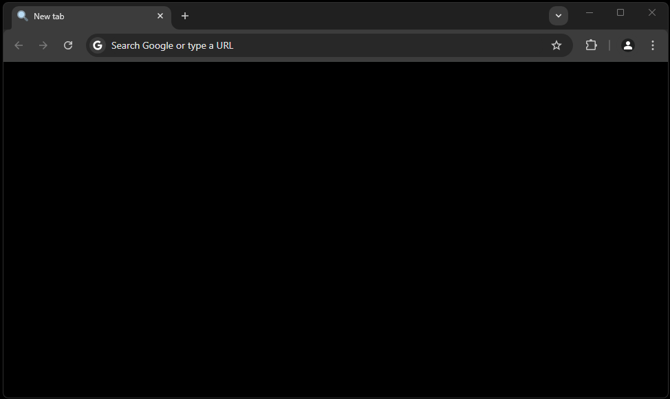

# [📄] Blank-NTP
A página de nova guia padrão do Google Chrome é muito poluída. Esta simples extensão cria uma página preta limpa. Caso não queira a página completamente preta, você pode modificar a cor no arquivo `tab.html`.

# [⚒️] Como usar
- Baixe o código do repositório e extraia o ZIP.
- Vá para o endereço `chrome://extensions/`

- Ative o *modo de desenvolvedor*.

- Carregue a extensão selecionando a pasta `src` do repositório.

- Aproveite!

